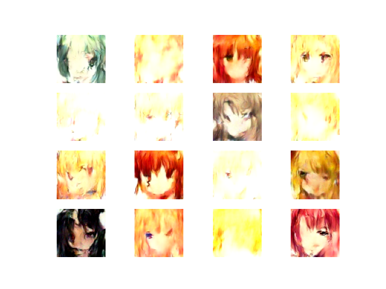

# Anime Face Generation using Diffusion Models (TensorFlow)

[](https://www.tensorflow.org/)
[](LICENSE)
[](https://www.python.org/)

A Deep Denoising Diffusion Probabilistic Model (DDPM) implemented **from scratch** using TensorFlow/Keras to generate high-quality anime faces. This repository contains the complete training pipeline, model architecture (custom U-Net with Attention), and generation scripts without relying on pre-trained HuggingFace pipelines.


*(Replace the link above with an actual grid of your generated images showing the denoising process)*

## 📄 Table of Contents
- [Introduction](#introduction)
- [Features](#features)
- [Dataset](#dataset)
- [Installation](#installation)
- [Project Structure](#project-structure)
- [Usage](#usage)
  - [Training](#training)
  - [Generation](#generation)
- [Model Architecture](#model-architecture)
- [Results](#results)
- [References](#references)

## 🤖 Introduction

Generative Adversarial Networks (GANs) have long been the standard for image generation. However, **Diffusion Models** have recently surpassed GANs in creating high-fidelity, diverse images. 

This project implements a DDPM (Denoising Diffusion Probabilistic Model) from the ground up. It works by:
1.  **Forward Process:** Gradually adding Gaussian noise to an anime image until it becomes pure random noise.
2.  **Reverse Process:** Training a neural network (U-Net) to predict and remove that noise step-by-step to recover a clean image.

## ✨ Features

* **Pure TensorFlow/Keras Implementation:** No high-level diffusion libraries; all logic is custom-written.
* **Custom U-Net Architecture:** Includes Residual Blocks, Downsampling/Upsampling layers, and **Self-Attention mechanisms** to handle fine details in anime art.
* **Sinusoidal Positional Embeddings:** Used to tell the model which "time step" of noise it is looking at.
* **Configurable Hyperparameters:** Easy to tweak image size, timesteps, beta schedules, and learning rates.

## 📂 Dataset

This model requires a dataset of anime faces. 
1.  We recommend using the [Anime Face Dataset](https://www.kaggle.com/datasets/splcher/animefacedataset) or specific tags from Danbooru.
2.  Download the dataset and extract it into a folder named `dataset/`.
3.  Ensure the folder structure looks like this:
    ```
    /dataset
        /images
            image_01.jpg
            image_02.png
            ...
    ```

## 🛠️ Installation

1.  **Clone the repository:**
    ```bash
    git clone [https://github.com/Abhaykum123/Anime-Face-Generation-.git](https://github.com/Abhaykum123/Anime-Face-Generation-.git)
    cd Anime-Face-Generation-
    ```

2.  **Install dependencies:**
    It is recommended to use a virtual environment.
    ```bash
    pip install tensorflow matplotlib numpy tqdm
    ```
    *(Note: GPU support for TensorFlow is highly recommended for reasonable training times).*

## 📁 Project Structure
```
Anime-Face-Generation/
│
├── models/ # U-Net and diffusion model definitions
├── dataset/ # Anime face dataset
├── tools/
│ ├── train.py # Training pipeline
│ └── inference.py # Image generation / sampling
├── config.yaml # Model & training configuration
├── requirements.txt
└── README.md
```
---

## ⚙️ Installation

Clone the repository and install dependencies:

```bash
git clone https://github.com/Abhaykum123/Anime-Face-Generation-.git
cd Anime-Face-Generation-
pip install -r requirements.txt
```
---

## 🧪 Applications

- Anime character generation

- Generative AI research

- Learning diffusion models from scratch

- Creative AI & art generation

- Foundation for Stable Diffusion–style projects

---

## 🛠️ Tech Stack

- Python

- TensorFlow / Keras

- NumPy

- OpenCV / PIL

  ---
 ## 📚 References
DDPM Paper: Denoising Diffusion Probabilistic Models (Ho et al., 2020)

TensorFlow Documentation: https://www.tensorflow.org/

---

## 📝 License
This project is licensed under the MIT License.

---
 
## 🙋‍♂️ Author

Abhay Kumar


  
